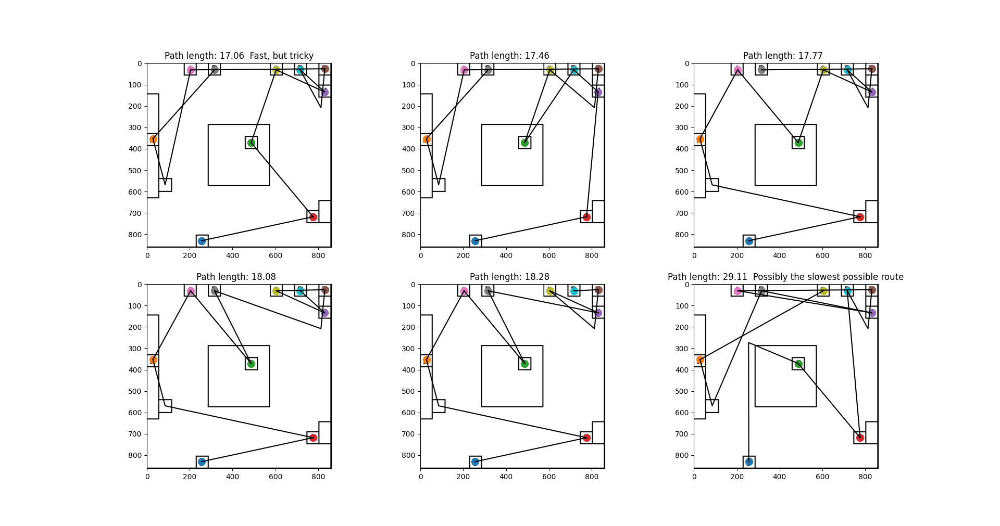

# stray-flat-speedrun-estimate
Estimate the fastest paths to complete The Flat in Stray

Very rough and inaccurate, but gives an idea.

Timings by Sebisu
Graphics by SliceofLife

## Some good and common routes (and one very bad one)
**Note, these assume you are able to move perfectly between each node (battery, socket, lever). Some routes may be easier than others, and it's more important to choose a route you are comfortable with doing quickly.**
